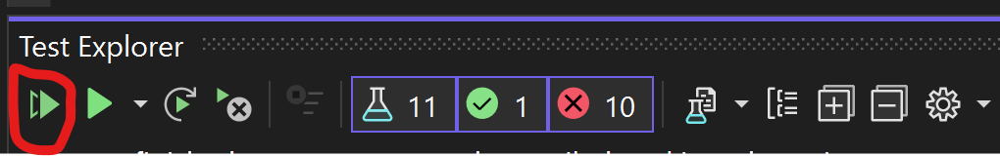
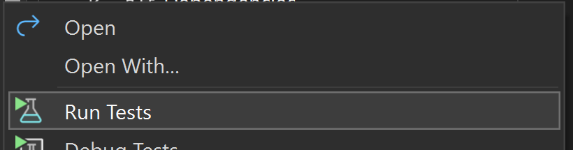

# How to run
These instructions assume that you already have installed Visual Studio 2022 (any edition) and .net 8 sdk.
They also assume you have some familiarity in cloning from a git-repository.
You can choose either suboption a or b depending which you find easier.

1. Clone the solution using git commands from command prompt or your favorite visual git tool to a folder of your choise, a good idea is to clone it somewhere shallow in the folder structure so it's easy to find.
2. Open Visual Studio, in the menu bar, click "File" and "Open" then "Project/Solution", navigate to this solution (LIS.sln) and double click it or double click on the solution file (LIS.sln) using the file explorer.

a) 
    1. In Visual Studio, in the menu bar, click "View" and then "Test Explorer".
    2. Locate the "Test explorer", if you have it docked or as a separate popup.
    3. Click the "fast forward" button/icon (Run all tests in view) or if you know the keyboard shortcut please use that.
       

b)
    1. In Visual Studio, if you do not have the "Solution Explorer" open, go to the menu bar and click "View" and then "Solution Explorer".
    2. Locate the "Solution Explorer", if you have it docked or as a separate popup.
    3. Expand the "LIS.Tests" project and right click on the "UnitTests.cs" file, then click "Run tests"
       

4. The tests should run and give a pass result